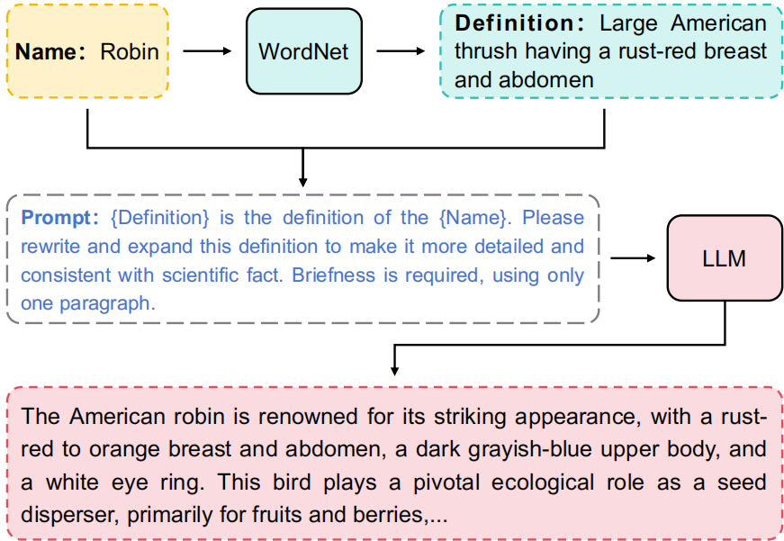
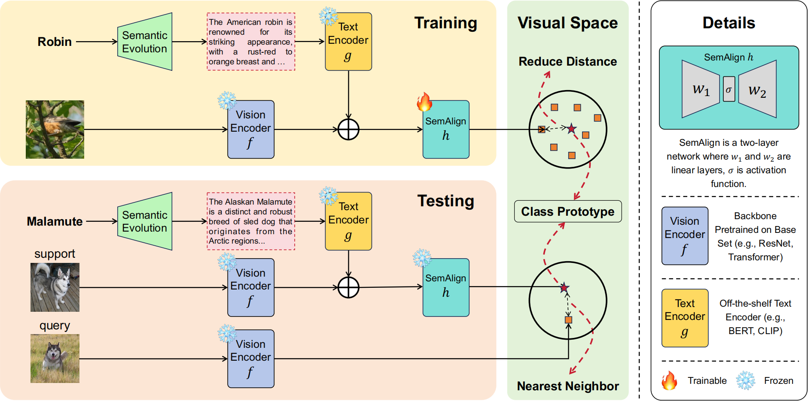

# [CVPR2024] Simple Semantic-Aided Few-Shot Learning

This is the official pytorch implementation of CVPR 2024 paper ["Simple Semantic-Aided Few-Shot Learning"] [[paper]](https://openaccess.thecvf.com/content/CVPR2024/papers/Zhang_Simple_Semantic-Aided_Few-Shot_Learning_CVPR_2024_paper.pdf) [[ArXiv]](https://arxiv.org/pdf/2311.18649.pdf). If you use any content of this repo for your work, please cite the following bib entry:

    @InProceedings{Zhang_2024_CVPR,
        author    = {Zhang, Hai and Xu, Junzhe and Jiang, Shanlin and He, Zhenan},
        title     = {Simple Semantic-Aided Few-Shot Learning},
        booktitle = {Proceedings of the IEEE/CVF Conference on Computer Vision and Pattern Recognition (CVPR)},
        month     = {June},
        year      = {2024},
        pages     = {28588-28597}
    }

# Method

We propose a semantic evolution approach for automatic collection of rich semantics, and with high-quality semantics the model achieves excellent results even with the simplest network structure.

**Semantic Evolution**

**Overall framework**

# Standard Few-shot Learning Results
|  Dataset  | 1-Shot 5-Way | 5-Shot 5-Way |  
|:--------:|:------------:|:------------:|
| FC100 |    54.27 ± 0.77     |    65.02 ± 0.72    |
|  CIFAR-FS  |     84.34 ± 0.67     |     89.11 ± 0.54    |
| MiniImageNet |    78.94 ± 0.66     |     86.49 ± 0.50    |
| TieredImageNet |      82.37 ± 0.77     |     89.89 ± 0.52    |

# Cross Domain Few-shot Learning Results
|  Dataset  | 1-Shot 5-Way | 5-Shot 5-Way |  
|:--------:|:------------:|:------------:|
| CUB      |    59.07     |    72.47    |
|  Places  |    64.01     |    74.70    |

# Prerequisites

The following prerequisites are required to run the scripts:

- [PyTorch and torchvision](https://pytorch.org)

- Dataset: Please download the dataset and modify the corresponding dataset path in the training file.

- Pre-trained weights: Please refer to [Google Cloud](https://drive.google.com/drive/folders/1J419EwA7gOKsXhmImKg_I-HvscyqLpBB?usp=sharing).

- Class center: Please run [[division/compute_center.py]](https://github.com/zhangdoudou123/SemFew/blob/main/division/compute_center.py) or [[division/compute_center_vit.py]](https://github.com/zhangdoudou123/SemFew/blob/main/division/compute_center_vit.py) to compute the approximate class center. 

# Training scripts

For example, to train the 1-shot/5-shot 5-way SemFew model with Resnet vision encoder and CLIP text encoder on MiniImageNet:

    $ python method/train_seman_l1_center.py --max-epoch 50 --mode clip --semantic-size 512 --text_type gpt --shot 1  --step-size 40 --test-batch 600 --batch-size 128 --beta 1 --num-workers 8 --dataset MiniImageNet --lr 1e-4
    $ python method/train_seman_l1_center.py --max-epoch 50 --mode clip --semantic-size 512 --text_type gpt --shot 5  --step-size 40 --test-batch 600 --batch-size 128 --beta 1 --num-workers 8 --dataset MiniImageNet --lr 1e-4

to train the 1-shot/5-shot 5-way SemFew model with Transformer vision encoder and CLIP text encoder on MiniImageNet:

    $ python method/train_seman_l1_center_vit.py --max-epoch 50 --mode clip --semantic-size 512 --text_type gpt --shot 1  --step-size 40 --test-batch 600 --batch-size 128 --beta 1 --num-workers 8 --dataset MiniImageNet --lr 1e-4
    $ python method/train_seman_l1_center_vit.py --max-epoch 50 --mode clip --semantic-size 512 --text_type gpt --shot 5  --step-size 40 --test-batch 600 --batch-size 128 --beta 1 --num-workers 8 --dataset MiniImageNet --lr 1e-4

# Acknowledgment

We thank the following repos providing helpful components/functions in our work.

- [ProtoNet](https://github.com/cyvius96/prototypical-network-pytorch)

- [FEAT](https://github.com/Sha-Lab/FEAT) 

- [FewTURE](https://github.com/mrkshllr/FewTURE)

- [CLIP](https://github.com/openai/CLIP)

- [BERT](https://github.com/google-research/bert)

- [ChatGPT](https://openai.com/chatgpt/)

